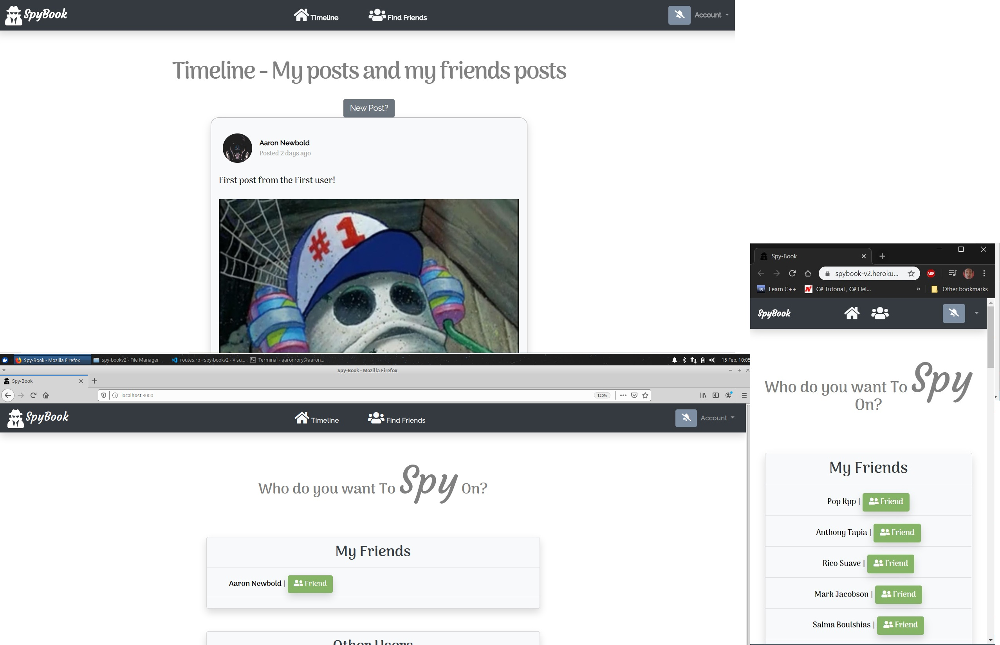

# SpyBook - Odin Facebook

> In this project, we built an app that imitates the basic function of Facebook. The SpyBook allows users to create posts, send friend requests, like posts and comments, comment on posts and recieve notifications.

### [Link to an article explaining the creation process of this project](https://hackernoon.com/ruby-on-rails-facebook-implementation-spybook-d51gz3y9o)

## Heroku Link: [Spy-Bookv2.com](https://spybook-v2.herokuapp.com/)

## Built With

- Ruby
- Ruby on Rails, Bootstrap
- Gems: Devise, RSpec, Capybara, database_cleaner, selenium-webdriver.

### Requirements

* Ruby 2.6.3
* Postgresql - [Instructions for installation](https://www.howtoforge.com/tutorial/ruby-on-rails-ror-with-postgresql-on-ubuntu-16-04/)

### Installation

* Download repository to your local machine, then run `bundle install` and run `rails db:setup`, `rails db:migrate` all within the terminal console.

### Automated Testing with [RSPEC](https://github.com/rspec/rspec-rails)

* Run `bundle exe rspec` within the terminal console after installing project repository.

## Authors

👤 **Aaron Rory**

- GitHub: [@Aaron-RN](https://github.com/Aaron-RN)
- Twitter: [@ARNewbold](https://twitter.com/ARNewbold)
- Linkedin: [Aaron Newbold](https://www.linkedin.com/in/aaron-newbold-1b9233187/)

👤 **Thaís Vieira Azevedo**

- GitHub: [@thsvr](https://github.com/thsvr)
- Twitter: [@vr_ths](https://twitter.com/vr_ths)
- Linkedin: [Thaís V.](https://www.linkedin.com/in/vr-ths-zd/)

## 🤝 Contributing

Contributions, issues and feature requests are welcome!

Feel free to check the [issues page](issues/).

## Show your support

Give a ⭐️ if you like this project!

## 📝 License

This project is [MIT](lic.url) licensed.
